# Credit Risk Analysis with Machine Learning

## Overview of the Analysis
The purpose of this analysis is to compare different machine learning approaches to the problem of identifying high risk loan applications. It is an inherently imbalanced classification problem, and several techniques to mitigiate that issue are tried here. 

The first three analyses used over or undersampling to create balance between the two classes. The fourth (SMOTEENN) combines the two, first using oversampling to create balance, and then undersampling to prune away the observations that are most likely to contribute to classification errors. Then logisitic regression classifiers were built using each set of resampled data.

Ensemble learning techniques were then explored. Balance is created in both ensemble learner techniques using undersampling. The first technique is random forest, the second is adaptive boosting.

Results for each classifier include accuracy, and precision and recall, focused on the minority class.

## Results
- Naive Random Oversampling - Accuracy: 65.5%, Precision: 0.01, Recall: 0.72

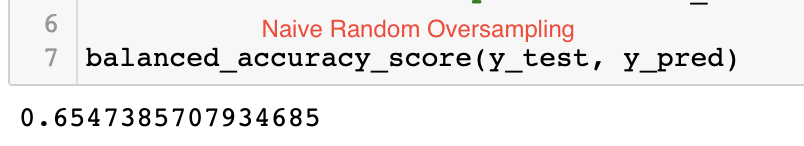
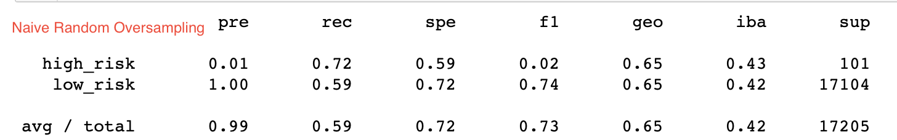

- SMOTE - Accuracy: 66.2%, Precision: 0.01, Recall: 0.63

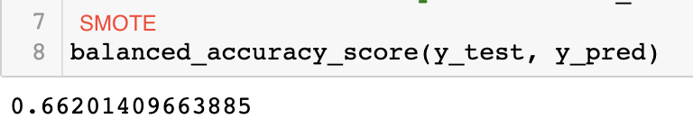
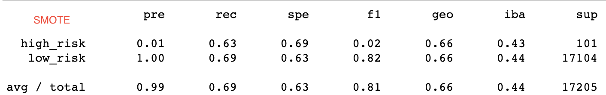

- Cluster Centroid (Undersampling) - Accuracy: 58.2%, Precision: 0.01, Recall: 0.61

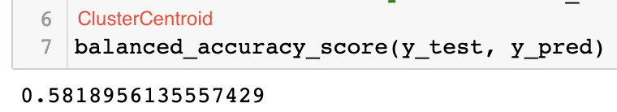
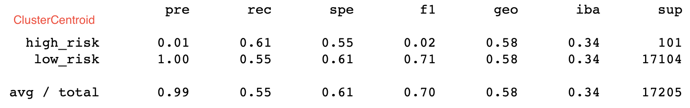

- SMOTEENN - Accuracy: 66.7%, Precision: 0.01, Recall: 0.72

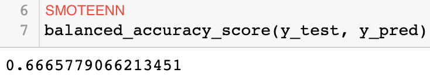
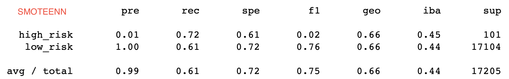

- Random Forest (Balanced) - Accuracy: 78.9%, Precision: 0.03, Recall: 0.70

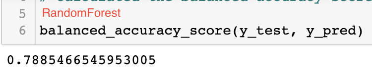
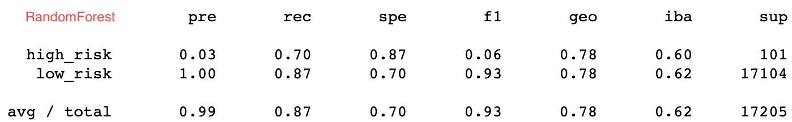

- Easy Ensemble (AdaBoost) - Accuracy:93.2%, Precision: 0.09, Recall: 0.92

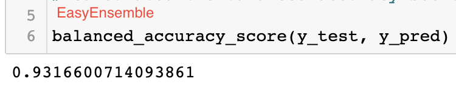
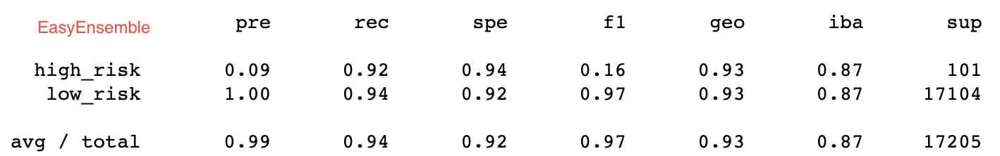

## Summary
